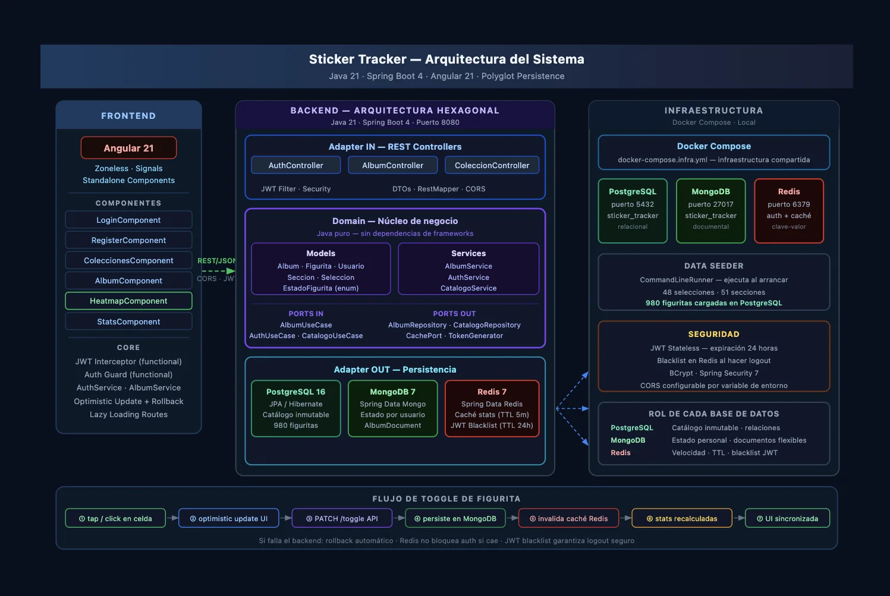

# Sticker Tracker — Frontend

Interfaz web para trackear el álbum de figuritas Panini FIFA World Cup 2026. Construido con Angular 21 usando las características más modernas del framework.

## Stack

| Tecnología | Versión |
|---|---|
| Angular | 21 |
| TypeScript | 5.x |
| RxJS | 7.x |
| SCSS | — |

## Características modernas de Angular 21

- **Zoneless Change Detection** — sin Zone.js, change detection explícito y eficiente
- **Signals** — `signal()`, `computed()`, `input()`, `output()` para reactividad declarativa
- **Standalone Components** — sin NgModules, cada componente importa sus dependencias
- **Lazy Loading** — rutas cargadas bajo demanda con `loadComponent()`
- **Functional Guards e Interceptors** — sin clases, solo funciones

## Estructura

```
src/app/
├── core/
│   ├── models/         # Interfaces TypeScript (Figurita, Album, Coleccion...)
│   ├── services/       # AuthService, AlbumService
│   ├── interceptors/   # jwt.interceptor.ts (funcional)
│   └── guards/         # auth.guard.ts (funcional)
├── features/
│   ├── auth/
│   │   ├── login/      # LoginComponent
│   │   └── register/   # RegisterComponent
│   ├── colecciones/    # ColeccionesComponent
│   └── album/
│       ├── stats/      # StatsComponent (input signals)
│       └── heatmap/    # HeatmapComponent
└── app.routes.ts       # Rutas lazy con loadComponent()
```

## Componentes principales

### HeatmapComponent
El componente más importante del proyecto. Renderiza las 980 figuritas como celdas rectangulares agrupadas por sección, con:

- Colores por estado: 🟢 TENGO · ⬜ FALTA · 🟡 REPETIDA
- Código de figurita visible como texto tenue en cada celda
- Tooltip en desktop (hover) con info completa
- Banner inferior en mobile (tap) — adaptativo sin conflictos de eventos
- **Optimistic update**: la UI actualiza inmediatamente, rollback si falla el backend
- Timer con `clearTimeout` para evitar cierres prematuros del banner

### StatsComponent
Recibe `AlbumStats` como `input.required<>()` y muestra:
- Grid de 4 tarjetas: Tengo / Faltan / Repetidas / % completado
- Barra de progreso animada con CSS transition

### AuthService
Gestión de autenticación con signals:
```typescript
private _token = signal<string | null>(localStorage.getItem('st_token'));
isAuthenticated = computed(() => !!this._token());
```

## Ciclo de toggle

```
FALTA → TENGO → REPETIDA → TENGO → ...
```

El toggle nunca vuelve a FALTA desde REPETIDA — lógica de dominio respetada en frontend y backend.

## Levantar en local

### Prerrequisitos
- Node.js 22+
- Angular CLI 21

### Instalación
```bash
npm install
```

### Desarrollo
```bash
ng serve
# http://localhost:4200
```

Asegúrate de que el backend esté corriendo en `http://localhost:8080/api/v1`.

### Variables de entorno
```typescript
// src/environments/environment.ts
export const environment = {
  production: false,
  apiUrl: 'http://localhost:8080/api/v1'
};
```

## Flujo de navegación

```
/ → /colecciones (requiere auth)
/login → POST /auth/login → guarda JWT → /colecciones
/register → POST /auth/register → guarda JWT → /colecciones
/album/:codigo → carga stats + 980 figuritas con estado del usuario
```

## Decisiones técnicas

| Decisión | Razón |
|---|---|
| Zoneless | Angular 21 standard, mejor performance |
| `input()` / `output()` | Reemplaza `@Input()` / `@Output()` — API más limpia |
| `touchend` en mobile | Más confiable que `touchstart` para acciones — no interfiere con scroll |
| Optimistic update + rollback | UX instantánea sin esperar al backend |
| `clearTimeout` en banner | Evita cierres prematuros al hacer taps rápidos |

## Arquitectura de toda la solución


## Revisión de documento
- _Versión: 1.0_
- _Autor: Jimmy Salazar_
